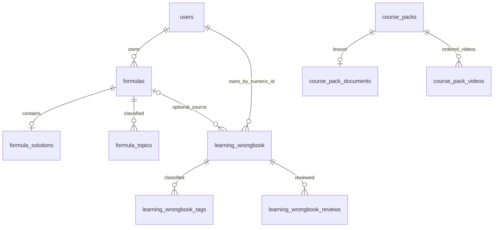

# 智算视界数据库

完整建表脚本位于 `../visdom_db.sql`，适用 MySQL 8.0。脚本包含 25 张表、主外键及查询索引，不包含账号、密码散列或用户内容，也不执行 DROP/TRUNCATE。

## 安装与升级

宝塔 / phpMyAdmin：先备份，左侧选中自己的库（截图为 `wiscomper_com`），点击「SQL」，复制 `html_root/visdom_db.sql` 全文执行。也可在「导入」中选择这个文件。无需创建或切换数据库，不需要逐个执行 migrations，也不依赖先启动网站。

命令行指定已存在的数据库：

```sh
mysql -u YOUR_USER -p --default-character-set=utf8mb4 YOUR_DATABASE < visdom_db.sql
```

同一个脚本同时支持空库安装与原网站 18 表结构升级：补齐到 25 表、索引及外键，并导入能精确匹配用户名的旧错题。保留原表与数据，支持重复执行。旧库排序规则保留，新表使用 `utf8mb4_general_ci`，用户名外键列跟随已有 users.username 的排序规则。要求 MySQL 8.0+；未验证 MariaDB / MySQL 5.7。

末尾查询显示当前数据库、表数和未匹配的旧错题数。若有手工改过的字段或孤儿数据导致报错，核实修复后重试，不通过删除原数据或关闭外键检查绕过。MySQL DDL 逐条提交，部署前保留数据库备份。

数据库连接通过环境变量或 `.env.local` 配置，让 `MYSQL_DB` 与面板当前库一致。完整部署步骤见 `../deploy/BAOTA.md`。应用仍保留自动迁移和以下维护命令：

```sh
python scripts/migrate_database.py
python scripts/migrate_database.py --apply
```

第一条显示状态，第二条应用未执行的迁移；手动执行完整 SQL 后无需另行复制历史迁移文件。

`schema_migrations` 保存版本、SHA-256 校验和及执行时间；已执行迁移不可直接改写，应新增版本。迁移通过数据库命名锁串行执行，业务请求不执行错题表的建表操作。

## 表结构一览

| 表 | 内容 | 主键 / 关联 |
| --- | --- | --- |
| users | 登录账户与密码散列 | id；username 唯一 |
| user_profiles | 昵称、头像 | user_id → users.username |
| user_settings | 个人设置 | user_id 为旧版用户名 |
| formulas | 算式、题目及备注 | id；user_id → users.username |
| formula_topics | 算式知识点 | id；formula_id → formulas.id |
| formula_solutions | 完整分步题解与动画信息 | formula_id → formulas.id，一对一 |
| animation_scripts | 已保存 Manim 代码 | id；user_id → users.username |
| agent_templates | 智能体模板及步骤 | id；user_id → users.username |
| user_achievements | 学习成就 | id；user_id + achievement_id 唯一 |
| course_packs | 私人课包名称与所有者 | id |
| course_pack_documents | 教案、简介与编辑版本 | pack_id → course_packs.id，一对一 |
| course_pack_resources | 有序题解与错题快照 | pack_id → course_packs.id；formula_id / wrongbook_id 为可空来源外键 |
| course_pack_videos | 课包中的有序视频引用 | pack_id + video_id；pack_id → course_packs.id |
| example_video_likes | 视频点赞 | video_id + user_id |
| example_video_comments | 视频评论 | id |
| example_video_danmaku | 带时间、颜色和位置的弹幕 | id |
| example_play_history | 视频续播进度 | user_id + video_id |
| example_video_notes | 私人时间戳笔记 | id |
| user_favorites | 视频收藏 | user_id + video_id |
| watch_later | 稍后观看 | user_id + video_id |
| learning_wrongbook | 错题内容、原题解快照与复习状态 | id；owner_id → users.id；formula_id → formulas.id |
| learning_wrongbook_tags | 错题知识点标签 | entry_id + tag；entry_id → learning_wrongbook.id |
| learning_wrongbook_reviews | 每次自评、心得及下次复习时间 | id；entry_id → learning_wrongbook.id |
| user_wrongbook | 旧版视频错题归档 | id；应用不再写入此表 |
| schema_migrations | 迁移版本与校验信息 | version |



## 错题本字段与规则

| 字段 | 设计 |
| --- | --- |
| owner_id | 数字用户 ID，改用户名不改变归属；仅服务端从会话解析 |
| source_type / video_id / time_sec | 手动、视频或分步题解来源；视频时间点用于回看 |
| formula_id | 可选来源算式；原算式删除时置空 |
| solution_snapshot | 经题解模型校验的 JSON 快照，原算式删除后仍可阅读和继续探索 |
| title / problem / answer / note | 标题、题目、参考答案、错因订正，支持 LaTeX 文本 |
| fingerprint | 精确来源与内容的 SHA-256，owner_id + fingerprint 唯一，防止重复点击和重复同步 |
| status / difficulty | 待复习、复习中、已掌握；难度 1–5 |
| revision | 乐观锁版本，旧编辑或重复复习提交返回 409，不覆盖新内容 |
| review_count / interval_days | 复习总次数与当前间隔 |
| next_review_at / last_reviewed_at | UTC 复习时间，前端按用户本地时间显示 |
| legacy_id | 与旧记录对应，迁移不会合并或丢弃旧表里的重复时间点 |

错题主表、标签和复习日志分开存储。新增/编辑/复习均在事务中完成；删除错题级联删除其标签和复习日志。列表使用服务端分页、账户条件、状态及标签筛选。关键索引覆盖账户与待复习日期、最近更新、视频时间点、标签及复习历史。

复习是用户自评：仍需练习安排 1 天后；基本掌握安排至少 3 天并在下次翻倍，最多 90 天；已掌握停止自动排期，可再次选择仍需练习。系统不会把自评标记表述为自动判题结果。

## 旧数据兼容

001 将可匹配账户的旧错题逐条迁入新表，保留原表。无法匹配账户的记录留在旧表，并由迁移工具报告数量；不猜测归属、不删除记录。浏览器本地旧错题由用户点击「同步本地记录」导入，成功后仍保留浏览器备份。

002 为原有用户名外键添加 ON UPDATE CASCADE；改名接口在同一事务中迁移其他旧版用户名字段，防止算式、课包、笔记或收藏失联。新错题表直接使用数字账户 ID。

003 补齐课包文档、课包视频、算式知识点的父子约束。对旧库新增约束时，若存在孤儿数据，数据库会拒绝添加约束，原数据保留；应先查明归属并修复后重试迁移，不通过关闭外键检查绕过。

为兼容当前网站，旧模块仍保留用户名型 user_id，不宣称已经全部转换为数字外键。视频依然采用站内文件目录 + video_id 引用，未引入与文件目录不同步的第二份视频主表。

## 验证

```sh
WISDOM_DATABASE_TESTS=1 python -m pytest tests/test_database_schema.py tests/test_wrongbook.py -q
```

浏览器测试另设 `WISDOM_BROWSER_TESTS=1`，需要本地 Chrome 和运行中的 Vite。SQL 测试创建隔离的临时数据库，执行完整建表与重复迁移，验证旧错题保留、外键和改名关联，最后只删除该临时测试库。

## 课包学习材料

迁移 `004_course_resources.sql` 新增 `course_pack_resources`。材料排序与视频排序分别保存，支持没有视频的教案和练习课包。写入时从当前会话校验课包和源题解/错题的所有权；同一课包不可重复引用同一来源。题目、答案、订正和完整分步题解以经过 Pydantic 校验的 JSON 快照保存。源题删除仅将外键置空，课包快照保留；课包删除级联删除材料。

材料变动与教案使用同一个 revision 和事务，旧版本返回 409。旧客户端未提供 resources 字段时保留已有材料。课包 JSON 导入清空来源 ID，只导入快照，避免误关联其他账户。导入的题解快照同样不携带可写入原算式的 ID。
